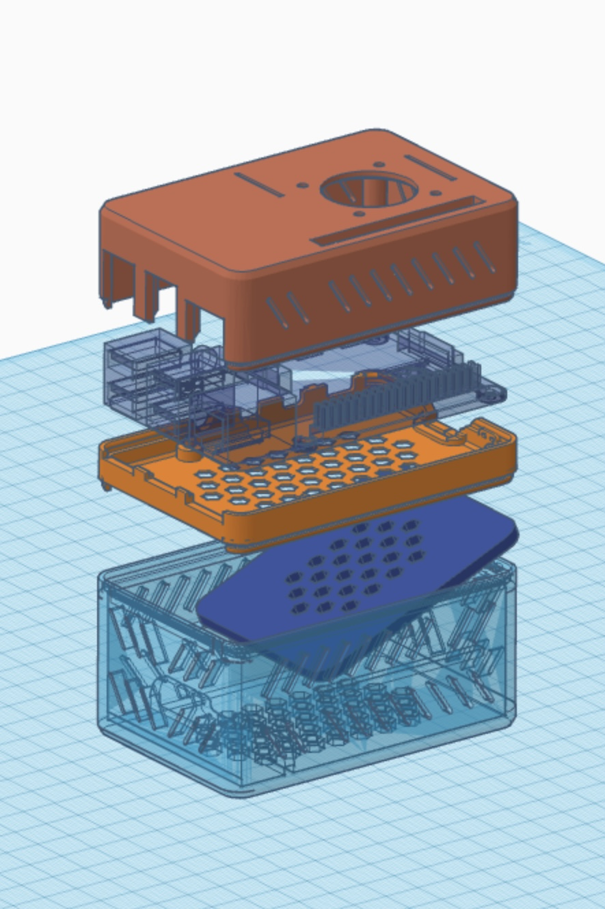

# Pi 4
Raspberry Pi 4 with UPS 3D Case 
with 9V/12V In 5V Out UPS design 
by RioLi

Original 3D Case design by Bigjeffrey

# UPS
UPS design by Samkalel3

DIY Step-Down and Step-Up super Cheap UPS for Raspberry Pis: https://www.reddit.com/r/raspberry_pi/comments/nsx3le/diy_stepdown_and_stepup_super_cheap_ups_for/

### 9V/12V In 5V Out UPS Equipment:

1. **Schottky Diodes:** 2 x 1N5822 Schottky Diodes
2. **Batteries:** 3 x 3.7V 18650 battery
3. **Battery Protection Circuit:** 1 x HX-2S-01
4. **Charging Board:** 1 x TP5100 Protection/Charging Board
5. **Step Down Buck Converter:** 1 x XL4015 DC-DC Step Down Buck Converter Power Module
6. **Power Jack:** 1 x DC 5.5*2.1 Power Jack Female
7. **USB Step Up Cable:** 1 x 5V to 9V/12V USB Step Up DC Power Cable 5.5*2.1

# 3D Case
Raspberry Pi 4 snap fit case with 30mm Fan by Bigjeffrey:
https://www.thingiverse.com/thing:3726254

I use this Raspberry Pi 4 3D model preview to remix the case

Raspberry Pi 4 3D Model for Case development by OculusQuest:
https://www.thingiverse.com/thing:4621310

# Use case
I install [Bitfocus Companion on Pi](https://github.com/bitfocus/companion) so it is a show control system for broadcast equipment like ATEM and Propresenter and because it have a UPS so my show more stable.

But i found out i can install Companion on Pc so i just [install Homeassistant](https://www.home-assistant.io/installation/raspberrypi/) on my Pi.

My Homeassistant run on my Proxmox before is was a VM and my Proxmox a not too stable so i just move my Homeassistant to my pi.
